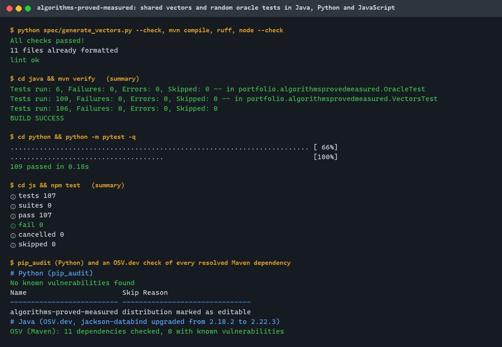
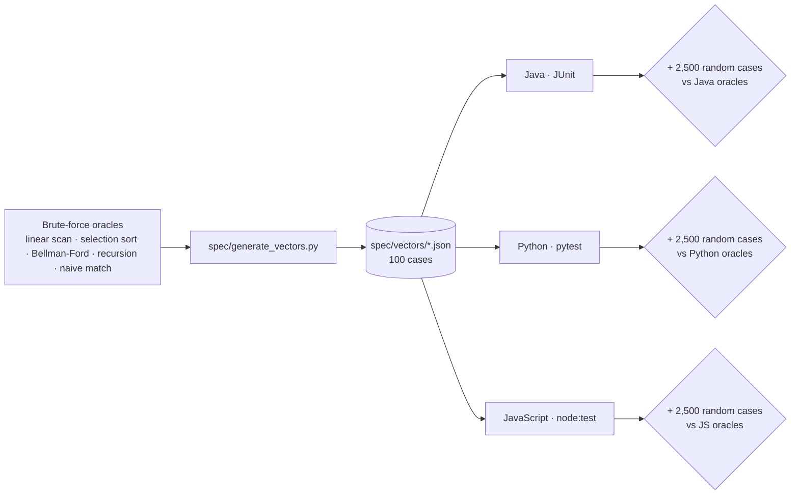
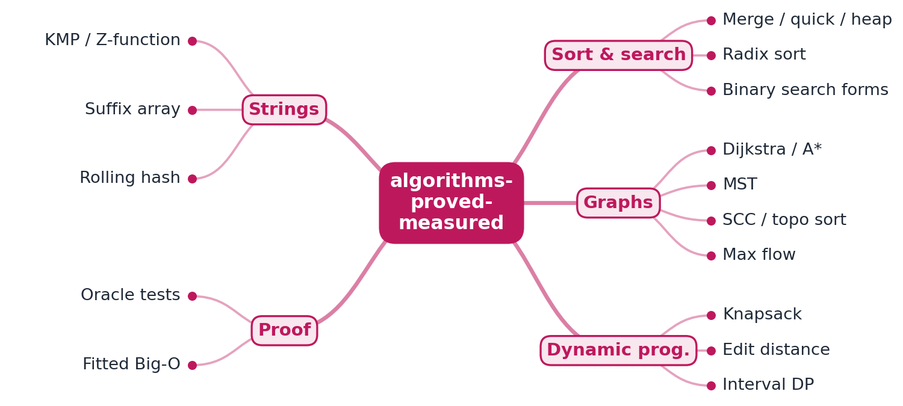
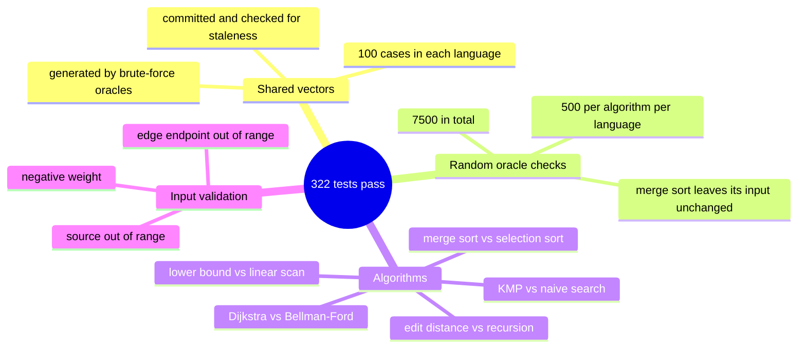

# algorithms-proved-measured

[](https://github.com/EquinoxWN/algorithms-proved-measured/actions/workflows/ci.yml)


> Stops 'it passed the sample input' from meaning 'it's correct': five classic algorithms in Java, Python and JavaScript, each checked against shared vectors and a brute-force oracle on random inputs.

Part of my **CS Foundations** list · Java · Python · JS · core project

## Proof it works

The shared vectors are checked to be up to date, then replayed with 500 random oracle comparisons per algorithm in each language: 106 Java, 109 Python and 107 JavaScript tests pass. Dependencies have no known vulnerabilities (the Java test dependency was upgraded during this check):



## Architecture

**What M1 runs today:**



**Full roadmap (M1 to M3):**



## How it works

_Steps 1 and 2 are built and tested (M1); the rest is on the [roadmap](#roadmap)._

1. Each algorithm exists in three languages behind the same signature and shared test vectors.
2. For small inputs a brute-force oracle computes the answer, and random tests compare against it to catch edge cases.
3. Each section gives a short correctness argument (loop invariant or exchange argument) and the expected complexity.
4. A harness runs every implementation on growing inputs and fits a log-log line to confirm measured growth matches the claim.
5. Where theory and measurement disagree (quicksort on sorted input, hashing with many collisions) the write-up explains why.
6. A pattern index maps problem shapes (two pointers, monotonic stack, interval DP) to algorithms, doubling as interview prep.

## Who it helps

- **Who:** Students preparing for interviews and engineers who write algorithmic code in Java, Python or JavaScript.
- **The problem:** An implementation can pass the sample inputs and still be wrong on edge cases nobody thought to write down.
- **How to use it:** Run `make test` to check the algorithms (binary search, merge sort, KMP search, Dijkstra and more) against shared test vectors and a brute-force oracle on random inputs, then reuse the vector-plus-oracle pattern to test your own implementations.

## Tech stack

| Area | In M1 | Planned |
|---|---|---|
| Code | Java, Python, JavaScript behind identical signatures | - |
| Tests | Shared vectors, brute-force oracles, random testing | - |
| Analysis | - | Log-log complexity fitting in Python + matplotlib |

One implementation per language, behind the same signature:

| Path | What it is |
|---|---|
| `spec/generate_vectors.py` | Builds `spec/vectors/*.json` from brute-force oracles; `--check` fails if they are stale |
| `java/src/main/java/.../` | `Search`, `Sorting`, `Graphs`, `DynamicProgramming`, `Strings` |
| `python/src/algorithms_proved_measured/` | `search.py`, `sorting.py`, `graphs.py`, `dp.py`, `strings.py` |
| `js/src/algorithms.js` | All five algorithms as ES module exports |
| `*/test*/` | Vector runners, brute-force oracles and random oracle tests per language |

| Algorithm | Technique | Oracle used to check it |
|---|---|---|
| Lower-bound binary search | Loop invariant on a half-open range | Linear scan |
| Merge sort | Divide and conquer | Selection sort |
| Dijkstra | Greedy with a priority queue | Bellman-Ford |
| Edit distance | Dynamic programming | Plain recursion |
| KMP search | Prefix function | Compare at every position |

## Run it

Needs JDK 21+ with Maven, Python 3.11+ and Node.js 24+.

```bash
make setup    # install the Python package and dev tools
make lint     # vectors up to date, Java compiles, ruff, node --check
make test     # vectors + random oracle tests in Java, Python and JavaScript
make vectors  # regenerate spec/vectors after changing the generator
```

Or one language at a time:

```bash
cd java && mvn verify
cd python && pytest
cd js && npm test
```

## Tests and results

Latest local run (full detail in [docs/results/m1.md](docs/results/m1.md)):

| Check | Java | Python | JavaScript |
|---|---|---|---|
| Shared vector cases (5 algorithms × 20) | 100 / 100 | 100 / 100 | 100 / 100 |
| Random inputs compared with a brute-force oracle | 2,500 / 2,500 | 2,500 / 2,500 | 2,500 / 2,500 |
| Invalid input rejected (Dijkstra) | yes | yes | yes |
| Tests passed | 106 | 109 | 107 |

In total, 7,500 random inputs were compared with an oracle and every one matched. `make lint` also checks that the committed vectors match the generator.

### Test map



## Roadmap

**M1** (≈15 h)
- [x] Write `docs/rfc/0001-design.md`: problem, goals, non-goals, chosen design
- [x] Each algorithm exists in three languages behind the same signature and shared test vectors.
- [x] For small inputs a brute-force oracle computes the answer, and random tests compare against it to catch edge cases.

**M2** (≈20 h)
- [ ] Each section gives a short correctness argument (loop invariant or exchange argument) and the expected complexity.
- [ ] A harness runs every implementation on growing inputs and fits a log-log line to confirm measured growth matches the claim.

**M3** (≈25 h)
- [ ] Where theory and measurement disagree (quicksort on sorted input, hashing with many collisions) the write-up explains why.
- [ ] A pattern index maps problem shapes (two pointers, monotonic stack, interval DP) to algorithms, doubling as interview prep.
- [ ] Publish the proof below with real numbers

## Proof

What this repo must show before it counts as done:

- Fitted-complexity charts per algorithm and oracle-tested case counts.

| Result | Value |
|---|---|
| M3 proof above | Not measured yet (M3). Current M1 numbers: see [Tests and results](#tests-and-results). |

## Why it matters

- **Interview angle:** Every coding round, including proving why the solution is correct and where its real bottleneck is.
- **Upstream I'd like to contribute to:** TheAlgorithms (Java / Python): fixes and tests for existing implementations, not new copies.

## Design docs

- [RFC 0001: design](docs/rfc/0001-design.md)
- [ADR 0001: record architecture decisions](docs/adr/0001-record-architecture-decisions.md)
- [ADR 0002: check every language against its own brute-force oracle](docs/adr/0002-oracle-per-language.md)
- [M1 results](docs/results/m1.md)

## Scope

This is a learning and portfolio system, not a hosted production service. Everything runs locally.

## Security and contributing

- Every GitHub Action is pinned to a commit SHA; workflows run read-only, without persisted credentials.
- Dependabot proposes dependency and action updates weekly.
- `ruff` with security (bandit) rules and `ruff format --check`, `mvn compile` and `node --check` on every push; `pip-audit` and OSV-Scanner on a CycloneDX SBOM of the Maven dependencies (`make audit`) in CI.
- Report vulnerabilities privately: see [SECURITY.md](SECURITY.md). To contribute, see [CONTRIBUTING.md](CONTRIBUTING.md).

## License

MIT, see [LICENSE](LICENSE).
